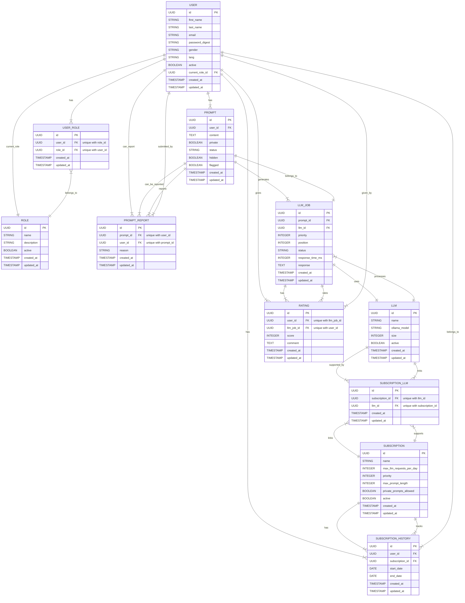

# Database Architecture

This document outlines the database structure for the LLM Mania application.

## Entity Relationship Diagram

## Entity Descriptions

### User
Represents application users with their personal information and subscription status.
- `gender`: Enum (male, female, other)
- `role`: Enum (user, admin)
- `lang`: String (en, de) - User's preferred interface language

### Subscription
Defines different subscription tiers with their associated features and limitations.
- `name`: String - Name of the subscription plan
- `description`: String - Description of the subscription plan
- `max_llm_requests_per_day`: Integer - Maximum number of LLM requests allowed per day
- `priority`: Integer - Priority level for request processing
- `max_prompt_length`: Integer - Maximum allowed prompt length
- `price_cents`: Integer - Price in cents
- `private_prompts_allowed`: Boolean - Whether private prompts are allowed
- `active`: Boolean - Whether the subscription is active

### Subscription History
Tracks the history of user subscriptions over time.

### Daily Usage
Monitors user's daily LLM request usage for quota management.

### Prompt
Stores user prompts sent to LLM.
- `private`: Replaces `is_private` to follow Rails boolean naming conventions
- `status`: Enum (waiting, in_queue, processing, completed, failed)

### Prompt Report
Handles user reports for inappropriate prompts.
- `user_id`: Nullable foreign key
- `reason`: Enum (spam, offensive, nsfw, other)

### LLM
Defines available LLM and their configurations.
- `ollama_model`: Name of the model in Ollama (e.g., "llama2", "mistral", etc.)
- `size`: Size of the model in billions of parameters

### LLM Job
Manages the processing of prompts by LLMs.
- `status`: Enum (queued, processing, completed, failed)
- `response`: Text - The response generated by the LLM

### Rating
Tracks user ratings and feedback for LLM responses.
- `score`: Integer (1-5) - User rating score
- `comment`: Text - User feedback comment

### Subscription LLM
Links subscriptions with their available LLM.
- `subscription_id`: UUID - Reference to the subscription
- `llm_id`: UUID - Reference to the LLM
- Represents a many-to-many relationship between subscriptions and LLM
- Determines which LLM are available for each subscription tier 